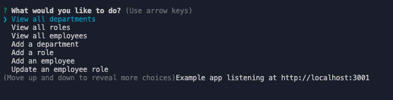
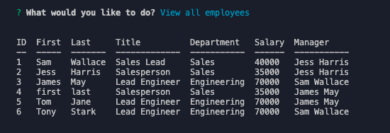
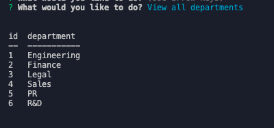

# Slacker Employee Tracker

## Introduction
Welcome to the Slacker Employee Tracker! Do you want you need to keep track of your employees and their information pertaining to the company? Well, we got the app for you. In this app you will be able to see a full listing of your departments, job roles and employees as well as being able to add employees and set their managers. This was a difficult project for me, but was definitely a learning experience. I was motivated to make this app because I know this is a need in the workplace and was ready to challenge myself on the backend programming. Using MySQL has been very interesting and I am excited to dive into it more and hopefully improve this app further!

## Installation

Make sure to npm install to get all pertinent packages for this app! 

## Link to Video Demo

## Screenshots

Starting choices

Example of viewing all employees

Example of viewing all departments
